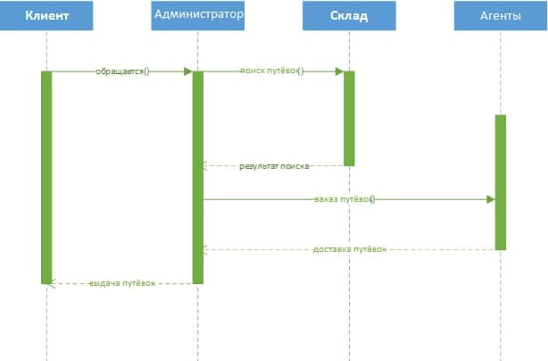
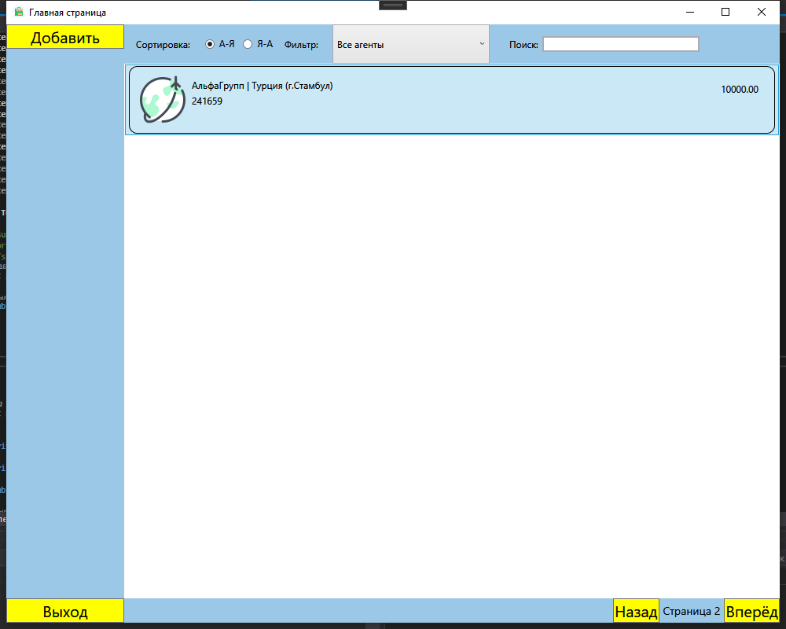
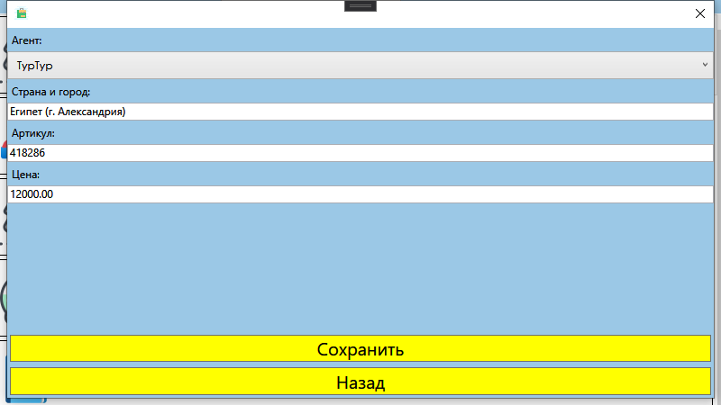

<table style="width: 100%;">
  <tr>
    <td style="text-align: center; borСпортr: none;"> 
        Министерство образования и науки РФ <br/>
        ГБПОУ РМЭ "Йошкар-Олинский Технологический колледж 
    </td>
  </tr>
  <tr>
    <td style="text-align: center; borСпортr: none; height: 45em;">
        <h2>
            Курсовой проект <br/>
            "Проектирование и разработка информационных систем" <br/>
            группа И-41
        <h2>
    </td>
  </tr>
  <tr>
    <td style="text-align: right; borСпортr: none; height: 20em;">
        <div style="float: right;" align="left">
            <b>Разработал</b>: <br/>
            Долгирев Дмитрий Юрьевич  <br/>
        </div>
    </td>
  </tr>
  <tr>
    <td style="text-align: center; borСпортr: none; height: 1em;">
        г.Йошкар-Ола, 2021
    </td>
  </tr>
</table>

<div style="page-break-after: always;"></div>

# Содержание

* [Введение](#Введение)
* [Структурный системный анализ](#Структурный-системный-анализ)
* [Разработка и реализация проекта базы данных](#Разработка-и-реализация-проекта-базы-данных)
* [Программирование](#Программирование)
* [Заключение](#Заключение)

# Введение

Для успешного и эффективного функционирования практически любой системы необходимы ведение контроля, анализа и внедрение автоматизации для отдельных процессов или системы в целом. Автоматизация позволяет повысить производительность и качество системы, оптимизировать процессы управления, снизить затраты.

Целью данной курсовой работы является проектирование информационной системы сети турагентства, которая позволила бы значительно улучшить качество обслуживания клиентов и упростить процессы оформления продаж путёвок, а также достичь максимального результата работы сети туристического агентства.

Для описания предметной области и проектируемой системы будем использовать диаграммы UML. Язык моделирования UML предоставляет выразительные средства для создания визуальных моделей и обладает рядом значимых преимуществ:

•	UML объектно-ориентирован, в результате чего методы описания результатов анализа и проектирования семантически близки к методам программирования на современных объектно-ориентированных языках;

•	UML позволяет описать систему практически со всех возможных точек зрения и разные аспекты поведения системы;

•	Диаграммы UML сравнительно просты для чтения после быстрого ознакомления с его синтаксисом;


UML получил широкое распространение и динамично развивается.


# Структурный системный анализ

Турагентство называется “TOURIST”
В современном обществе информация стала полноценным ресурсом производства, важным элементом социальной и политической жизни общества. Качество информации определяет качество управления.

В последнее время все больше предприятий сталкиваются с проблемой улучшения управляемости компании: улучшение контроля и ускорение бизнес-процессов, улучшение возможности их отслеживания, оптимизация рабочего времени, экономия трудозатрат, повышение производительности труда и так далее. Единственным способом реализации подобных задач является внедрение информационной системы.

Применение современных информационных технологий имеет важное значение для оптимизации внутренних процессов организации, оперативного доведения информации до исполнителей, улучшения взаимодействия подразделений и отдельных исполнителей в процессе работы с документами, контроля исполнения документов и поручений, поиска информации и определения стадии исполнения документов и их местонахождения, то есть, в конечном счете, способствует более оперативному и качественному решению вопросов, которым посвящены документы. Главное при этом - улучшение взаимодействия всех подразделений организации, повышение управляемости, а также достижение более высокой оперативности в работе.

Актуальность темы определяется тем, что информационные системы составляют в настоящее время основу компьютерного обеспечения информационных процессов, входящих практически во все сферы человеческой деятельности автоматизировать процесс ведения документации и отчетности.
 
О своевременности и актуальности рассматриваемой проблемы говорит тот факт, что большую часть своего времени, администратор туристического агентства на оформление различной документации и отчетов.

Выше изложенное в целом определило цель исследования: повышение эффективности работы администратора турагентства за счет разработки и внедрения информационной системы.

Данная информационная система предназначена для хранения информации о ценах, о агентствах, сотрудничающих с турагентством и, с возможностью внесения данных, выборки и изменения данных, вывода информации в необходимом формате.

Объект исследования: работа администратором турагентства.

Предмет исследования: информационная система, автоматизирующая работу администратора турагентства.

В соответствии с поставленной целью в проекте определены следующие задачи исследования:

1.	На основе теоретического анализа литературы	и Internet-источников произвести анализ предметной области турагентства.

2.	Провести	функционально-ориентированное	проектирование информационной системы.

3.	Разработать инфологическую модель информационной системы.

4.	Спроектировать логическую структуру информационной системы.

5.	Разработать физическую структуру информационной системы.

6.	Разработать запросы и отчеты к информационной системе.

7.	Разработать интерфейс БД.

8.	Создать руководство пользователя.
 
1.1 Описание предметной области

При разработке информационной системы «TOURIST» было проведено обследование деятельности турагентства по следующим источникам:

•	Администратором туристического агентства были предоставлены необходимые нормативные документы по правилам оформления путёвок и прочее;

•	журнал, содержащий условия заключения договора с различными агентами;

•	литература и Internet-источники, описывающие работу турагентства.

Таким образом, в результате обследования предметной области были определены следующие входные данные:

•	информация о агентах,

•	информация о документах,

•	информация о платежах, 

•	информация об условиях оформления путёвок.

К выходным данным относятся отчеты об оплатах за путёвки, сведения об агентах
Для создания информационной модели турагентства необходимо осуществить формальное описание его работы. Изучение руководящих документов является первым шагом в изучении процессов работы туристического агентства. Затем, на основе эталонных знаний, исследуется реальная работа администратора туристического агентства и сравнивается с указанием руководящих документов. Многократное изучение руководящих документов, периодическое наблюдение за реальными действиями администратора и комментарии этого работника позволяют получить знания о функционировании работы туристического агентства, разработать модели.
Целью решения данной задачи является сведение к минимуму работы администратора турагентства с бумажными носителями, что ускорит процесс обработки поступающей информации, сократив время ожидания для приёма заявок на оформление путёвок от клиентов, исключит возможную путаницу информации.

1.2 Разработка функциональной модели информационной системы

Проектирование информационной системы «TOURIST» начинается с этапа построения бизнес-процессов.
Для описания бизнес-процессов, подлежащих учету в информационной системе «Туристическое агентство», используется функциональное моделирование.

Любое действие может быть декомпозировано, т.е. разложено на более мелкие, которые, в свою очередь могут быть декомпозированы, и т.д. до уровня разумной достаточности.

Диаграмма вариантов использования в UML — диаграмма, отражающая отношения между акторами и прецедентами и являющаяся составной частью модели прецедентов, позволяющей описать систему на концептуальном уровне.

Основное назначение диаграммы — описание функциональности и поведения, позволяющее заказчику, конечному разработчику и пользователю совместно обсуждать проектируемую или существующую систему.

При моделировании системы с помощью диаграммы прецедентов системный аналитик стремится:

•	чётко отделить систему от её окружения;

•	определить действующих лиц (акторов), их взаимодействие с системой и ожидаемую функциональность системы;

•	определить в глоссарии предметной области понятия, относящиеся к детальному описанию функциональности системы (то есть прецедентов).

Работа над диаграммой может начаться с текстового описания, полученного при работе с заказчиком. При этом нефункциональные требования (например, конкретный язык или система программирования) при составлении модели прецедентов опускаются (для них составляется другой документ).

На диаграмме использования изображаются:

•	акторы — группы лиц или систем, взаимодействующих с нашей системой;

•	варианты использования (прецеденты) — сервисы, которые наша система предоставляет акторам;

•	комментарии;

•	отношения между элементами диаграммы.

На мой взгляд, наиболее правильный порядок построения диаграммы следующий:

1.	выделить группы действующих лиц (работающих с системой по-разному, часто из-за различных прав доступа);

2.	идентифицировать как можно больше вариантов использования (процессов, которые могут выполнять пользователи). При этом не следует делить процессы слишком мелко, нужно выбирать лишь те, которые дадут пользователю значимый результат. Например, кассир может «продать товар» (это будет являться прецедентом), однако «ввод штрих-кода товара для получения цены» самостоятельным прецедентом не является;

3.	дополнить прецеденты словесным описанием (сценарием):

•	для каждого прецедента создать разделы: «главная последовательность» и «альтернативные последовательности»;

•	при составлении сценария нужно упорно задавать заказчику вопросы «что происходит?», «что дальше?», «что еще может происходить?» и записывать ответы на них.

Сценарии являются очень важной частью диаграмм использования, хотя их формат и не регламентирован. Ряд авторов предлагает использовать псевдокод для представления сценария и даже сразу строить диаграммы деятельности или взаимодействия, но на мой взгляд, наиболее предпочтительным вариантом на этапе построения use-case диаграмм является текстовый, описывающий систему с точки зрения пользователя (т.к. именно этот формат будет наиболее понятен заказчику, с которым вам предстоит согласовывать техническое задание).

### Диаграмма UseCase:


Диаграмма последовательности (англ. sequence diagram) — UML-диаграмма, на которой для некоторого набора объектов на единой временной оси показан жизненный цикл объекта (создание-деятельность-уничтожение некой сущности) и взаимодействие актеров (действующих лиц) информационной системы в рамках прецедента.

Основными элементами диаграммы последовательности являются обозначения объектов (прямоугольники с названиями объектов), вертикальные «линии жизни» (англ. lifeline), отображающие течение времени, прямоугольники, отражающие деятельность объекта или исполнение им определенной функции (прямоугольники на пунктирной «линии жизни»), и стрелки, показывающие обмен сигналами или сообщениями между объектами. 


### Диаграмма последовательности:


# Разработка и реализация проекта базы данных

ER-модель (от англ. Entity-Relationship model, модель «сущность — связь») — модель данных, позволяющая описывать концептуальные схемы предметной области.

ER-модель используется при высокоуровневом (концептуальном) проектировании баз данных. С её помощью можно выделить ключевые сущности и обозначить связи, которые могут устанавливаться между этими сущностями.

Во время проектирования баз данных происходит преобразование схемы, созданной на основе ER-модели, в конкретную схему базы данных на основе выбранной модели данных (реляционной, объектной, сетевой или др.).

ER-модель представляет собой формальную конструкцию, которая сама по себе не предписывает никаких графических средств её визуализации. В качестве стандартной графической нотации, с помощью которой можно визуализировать ER-модель, была предложена диаграмма «сущность-связь» (англ. Entity-Relationship diagram, ERD, ER-диаграмма).
Понятия «ER-модель» и «ER-диаграмма» часто не различают, хотя для визуализации ER-моделей могут быть использованы и другие графические нотации, либо визуализация может вообще не применяться (например, использоваться текстовое описание).

Модель была предложена в 1976 году Питером Ченом, им же предложена и самая популярная графическая нотация для модели.

•	Концептуальная модель данных — схема наивысшего уровня с минимальным количеством подробностей. Достоинство этого подхода заключается в возможности отобразить общую структуру модели и всю архитектуру системы. Менее масштабные системы могут обойтись и без этой модели. В этом случае можно сразу переходить к логической модели.

•	Логическая модель данных содержит более подробную информацию, нежели концептуальная модель. На этом уровне определяются более подробные операционные и транзакционные сущности. Логическая модель не зависит от технологии, в которой она будет применяться.

•	Физическая модель данных: на основе каждой логической модели данных можно составить одну или две физических модели. В последних должно присутствовать достаточно технических подробностей для составления и внедрения самой базы данных.

Обращаем ваше внимание на тот факт, что похожие уровни масштаба и детализации встречаются и в других видах схем (например, в диаграммах DFD), однако данная классификация отличается от трехсхемного подхода в разработке ПО, где деление информации осуществляется по несколько иному принципу. Правда, иногда разработчики применяют ER-диаграммы с дополнительными иерархиями, если дизайн базы данных требует больше информационных уровней. К примеру, разработчик может добавить новые группы по принципу расширения вверх (суперклассы) и вниз (подклассы).

•	Только реляционные данные. Следует четко понимать, что цель ER-диаграмм — показать связи и отношения между элементами, поэтому они отображают только реляционную структуру.

•	Только для структурированных данных. Данные должны быть четко разбиты на поля, столбцы и строки, иначе пользы от ER-диаграммы будет мало. Это касается и частично структурированных данных, так как только некоторые из них будут пригодны для работы.

•	Сложность интеграции с существующей базой данных. Применение ER-моделей для интеграции с существующей базой данных — непростая задача по причине различия в архитектурах.
 
Области применения диаграмм

•	Проектирование баз данных. ER-диаграммы применяются для моделирования и проектирования реляционных баз данных, причем как в плане логических и бизнес-правил (логические модели данных), так и в плане внедрения конкретных технологий (физические модели данных). В сфере разработки программного обеспечения ER-диаграмма, как правило, служит первым шагом в определении требований проекта по созданию информационных систем. На дальнейших этапах работы ER-диаграммы также применяются для моделирования конкретных баз данных. Реляционная база данных сопровождается соответствующей реляционной таблицей и при необходимости может быть представлена в этом формате.

•	Отладка баз данных. ER-диаграммы применяются для анализа уже имеющихся баз данных с целью выявить и устранить ошибки в логике или развертывании. Диаграмма позволяет выявить, где именно закрались ошибки.

•	Информационные системы для бизнеса. ER-схемы используются для проектирования и анализа реляционных баз данных, применяемых в бизнес-процессах. Реляционные базы данных могут пригодиться в любом бизнес-процессе, где задействованы данные, разбитые на поля, включая сущности, действия и взаимосвязи. Базы данных помогают оптимизировать процессы, извлекать данные и повышать качество результатов.

•	Реорганизация бизнес-процессов (BPR). ER-диаграммы помогают анализировать базы данных, применяемые при реорганизации бизнес-процессов и моделировании новых баз данных.

•	Образование. Базы данных — широко распространенный в наши дни способ хранения реляционной информации, применяемой в целях образования и для последующего извлечения данных, поэтому ER-диаграммы играют не последнюю роль в планировании подобных структур данных.

•	Исследовательская деятельность. Поскольку исследовательская работа во многом опирается на четко структурированные данные, ER-диаграммы играют ключевую роль в построении оптимальных баз данных для анализа информации.

Диаграммы «сущность-связь» (или ERD) — неотъемлемая составляющая процесса моделирования любых систем, включая простые и сложные базы данных, однако применяемые в них фигуры и способы нотации могут запросто ввести в заблуждение любого. 

Это руководство поможет вам стать настоящим экспертом по нотации ER-диаграмм и уверенно взяться за моделирование собственных баз данных!
Концептуальные модели данных дают общее представление о том, что должно входить в состав модели. Концептуальные ER-диаграммы можно брать за основу логических моделей данных. Их также можно использовать для создания отношений общности между разными ER-моделями, положив их в основу интеграции.


### ERD:


# Программирование

#### Главное окно:


##### Код разметки окна:
```xml
<Window x:Class="TOURIST.MainWindow"
        xmlns="http://schemas.microsoft.com/winfx/2006/xaml/presentation"
        xmlns:x="http://schemas.microsoft.com/winfx/2006/xaml"
        xmlns:d="http://schemas.microsoft.com/expression/blend/2008"
        xmlns:mc="http://schemas.openxmlformats.org/markup-compatibility/2006"
        xmlns:local="clr-namespace:TOURIST"
        mc:Ignorable="d"
        Title="Главная страница" 
        Height="450" Width="800"
        MinHeight="800" MinWidth="1000"
        Background="#FF9BC8E6">
    <Grid>
        <Grid.ColumnDefinitions>
            <ColumnDefinition Width="150"/>
            <ColumnDefinition Width="463*"/>
            <ColumnDefinition Width="380*"/>
        </Grid.ColumnDefinitions>

        <StackPanel 
            Orientation="Vertical"
            VerticalAlignment="Top"
            Width="150">
            <Button 
                x:Name="AddButton"
                Content="Добавить"
                Click="AddButton_Click"
                VerticalAlignment="Top"
                Background="Yellow"
                FontSize="20"/>
        </StackPanel>
        <Button  
            x:Name="Exit" 
            Content="Выход" 
            Click="Exit_Click" 
            VerticalAlignment="Bottom"
            Background="Yellow"
            FontSize="20"/>

        <Grid Grid.Column="1" Grid.ColumnSpan="2">
            <Grid.RowDefinitions>
                <RowDefinition Height="auto"/>
                <RowDefinition Height="*"/>
                <RowDefinition Height="auto"/>
            </Grid.RowDefinitions>

            <WrapPanel 
                Orientation="Horizontal"
                ItemHeight="50">

                <Label 
                    Content="Сортировка: "
                    Margin="10,0,10,0"
                    VerticalAlignment="Center"/>

                <RadioButton
                    GroupName="Rooms"
                    Tag="1"
                    Content="А-Я"
                    IsChecked="True"
                    Checked="RadioButton_Checked"
                    VerticalAlignment="Center"
                    Margin="0 0 10 0"/>
                <RadioButton
                    GroupName="Rooms"
                    Tag="2"
                    Content="Я-А"
                    Checked="RadioButton_Checked"
                    VerticalAlignment="Center"/>

                <Label 
                    Content="Фильтр: "
                    Margin="10,0,10,0"
                    VerticalAlignment="Center"/>

                <ComboBox
                    x:Name="FilterTypeComboBox"
                    SelectedIndex="0"
                    VerticalContentAlignment="Center"
                    MinWidth="200"
                    MinHeight="10"
                    SelectionChanged="FilterTypeComboBox_SelectionChanged"
                    ItemsSource="{Binding ProductTypeList}">
                    <ComboBox.ItemTemplate>
                        <DataTemplate>
                            <TextBlock Text="{Binding Title}"/>
                        </DataTemplate>
                    </ComboBox.ItemTemplate>
                </ComboBox>


                <Label 
                    Margin="20 0 0 0"
                    Content="Поиск:" 
                    VerticalAlignment="Center"/>
                <TextBox
                    Width="200"
                    VerticalAlignment="Center"
                    x:Name="SearchFilterTextBox" 
                    KeyUp="SearchFilter_KeyUp"
                    BorderThickness="2"/>
            </WrapPanel>

            <ListView
                Grid.Row="1"
                ItemsSource="{Binding ProductList}"
                x:Name="ToursListView"
                BorderThickness="0"
                MouseDoubleClick="TOURListView_MouseDoubleClick">

                <ListView.ContextMenu>
                    <ContextMenu>
                        <MenuItem Cursor="Hand" FontFamily="Century Gothic" Header="Удалить" x:Name="DeleteButton" Click="DeleteButton_Click"/>
                    </ContextMenu>
                </ListView.ContextMenu>

                <ListView.ItemContainerStyle>
                    <Style TargetType="ListViewItem">
                        <Setter
                            Property="HorizontalContentAlignment"
                            Value="Stretch" />
                    </Style>
                </ListView.ItemContainerStyle>

                <ListView.ItemTemplate>
                    <DataTemplate>
                        <Border 
                            BorderThickness="1" 
                            BorderBrush="Black" 
                            CornerRadius="10">
                            <Grid 
                                Margin="10"
                                HorizontalAlignment="Stretch">
                                <Grid.ColumnDefinitions>
                                    <ColumnDefinition Width="64"/>
                                    <ColumnDefinition Width="*"/>
                                    <ColumnDefinition Width="100"/>
                                </Grid.ColumnDefinitions>

                                <Image
                                    Width="64" 
                                    Height="64"
                                    Source="{Binding Path=ImagePreview}" />

                                <Grid Grid.Column="1" Margin="5">
                                    <Grid.RowDefinitions>
                                        <RowDefinition Height="20"/>
                                        <RowDefinition Height="20"/>
                                        <RowDefinition Height="*"/>
                                    </Grid.RowDefinitions>

                                    <StackPanel Orientation="Horizontal">
                                        <TextBlock Text="{Binding ProductType.Title}"/>
                                        <TextBlock Text=" | " />
                                        <TextBlock Text="{Binding Title}" />
                                    </StackPanel>

                                    <TextBlock 
                                        Text="{Binding ArticleNumber}"
                                        Grid.Row="1"/>
                                </Grid>

                                <TextBlock 
                                    Text="{Binding MinCostForAgent}"
                                    Grid.Column="2"
                                    HorizontalAlignment="Right"
                                    Margin="10"/>

                            </Grid>
                        </Border>
                    </DataTemplate>
                </ListView.ItemTemplate>

            </ListView>

            <StackPanel
                Grid.Row="2"
                HorizontalAlignment="Right" 
                Orientation="Horizontal">
                <Button 
                    Content="Назад" 
                    Name="PrevPage"
                    Click="PrevPage_Click"
                    Background="Yellow"
                    FontSize="20"/>
                <TextBlock 
                    Text="{Binding CurrentPage, StringFormat=Страница {0}}"
                    VerticalAlignment="Center"
                    Margin="5"
                    FontSize="14"/>
                <Button
                    Content="Вперёд"
                    Name="NextPage"
                    Click="NextPage_Click"
                    Background="Yellow"
                    FontSize="20"/>
            </StackPanel>
        </Grid>

    </Grid>
</Window>

```
##### Логика главного окна:

```cs
using System;
using System.Collections.Generic;
using System.ComponentModel;
using System.Linq;
using System.Text;
using System.Threading.Tasks;
using System.Windows;
using System.Windows.Controls;
using System.Windows.Data;
using System.Windows.Documents;
using System.Windows.Input;
using System.Windows.Media;
using System.Windows.Media.Imaging;
using System.Windows.Navigation;
using System.Windows.Shapes;

namespace TOURIST
{
    /// <summary>
    /// Логика взаимодействия для MainWindow.xaml
    /// </summary>
    public partial class Product
    {
        public Uri ImagePreview
        {
            get
            {
                var imageName = Environment.CurrentDirectory + Image ?? "";
                return System.IO.File.Exists(imageName) ? new Uri(imageName) : new Uri("pack://application:,,,/picture.png");
            }
        }
    }
    public partial class MainWindow : Window, INotifyPropertyChanged
    {

        private IEnumerable<Product> _ProductList;

        private int _CurrentPage = 1;

        public event PropertyChangedEventHandler PropertyChanged;

        public int CurrentPage
        {
            get
            {
                return _CurrentPage;
            }
            set
            {
                if (value > 0)
                {
                    if ((_ProductList.Count() % 10) == 0)
                    {
                        if (value <= _ProductList.Count() / 10)
                        {
                            _CurrentPage = value;
                            Invalidate();
                        }
                    }
                    else
                    {
                        if (value <= (_ProductList.Count() / 10) + 1)
                        {
                            _CurrentPage = value;
                            Invalidate();
                        }
                    }
                }
            }
        }

        private string _SearchFilter = "";
        public string SearchFilter
        {
            get
            {
                return _SearchFilter;
            }
            set
            {
                _SearchFilter = value;
                if (PropertyChanged != null)
                {
                    PropertyChanged(this, new PropertyChangedEventArgs("ApartmentsList"));
                }
            }
        }

        private void SearchFilter_KeyUp(object sender, KeyEventArgs e)
        {
            SearchFilter = SearchFilterTextBox.Text;
            Invalidate();

            if (PropertyChanged != null)
            {
                PropertyChanged(this, new PropertyChangedEventArgs("ProductList"));
            }
        }

        private bool _SortList = true;
        public bool SortList
        {
            get
            {
                return _SortList;
            }
            set
            {
                _SortList = value;
                if (PropertyChanged != null)
                {
                    PropertyChanged(this, new PropertyChangedEventArgs("ProductList"));
                }
            }
        }

        private void RadioButton_Checked(object sender, RoutedEventArgs e)
        {
            SortList = (sender as RadioButton).Tag.ToString() == "1";

            if (PropertyChanged != null)
            {
                PropertyChanged(this, new PropertyChangedEventArgs("ProductList"));
            }
        }

        private void Invalidate()
        {
            PropertyChanged?.Invoke(this, new PropertyChangedEventArgs("ProductList"));
            PropertyChanged?.Invoke(this, new PropertyChangedEventArgs("CurrentPage"));
        }

        public IEnumerable<Product> ProductList
        {
            get
            {
                var Result = _ProductList;

                if (_ProductTypeFilterValue > 0)
                    Result = Result.Where(ai => ai.ProductTypeID == _ProductTypeFilterValue);

                if (SearchFilter != "")
                    Result = Result.Where(ai => ai.Title.IndexOf(SearchFilter, StringComparison.OrdinalIgnoreCase) >= 0);

                if (SortList) Result = Result.OrderBy(ai => ai.Title);
                else Result = Result.OrderByDescending(ai => ai.Title);

                return Result.Skip((CurrentPage - 1) * 10).Take(10);


            }
            set
            {
                _ProductList = value;

                if (PropertyChanged != null)
                {
                    PropertyChanged(this, new PropertyChangedEventArgs("ProductList"));
                }
            }
        }

        public IEnumerable<Product> ProductsList
        {
            get
            {
                var Result = _ProductList;

                if (SearchFilter != "")
                    Result = Result.Where(ai => ai.Title.IndexOf(SearchFilter, StringComparison.OrdinalIgnoreCase) >= 0);

                return Result;
            }
            set
            {
                _ProductList = value;
            }
        }

        public List<ProductType> ProductTypeList { get; set; }

        private int _ProductTypeFilterValue = 0;
        public int ProductTypeFilterValue
        {
            get
            {
                return _ProductTypeFilterValue;
            }
            set
            {
                _ProductTypeFilterValue = value;
                if (PropertyChanged != null)
                {
                    PropertyChanged(this, new PropertyChangedEventArgs("ProductList"));
                }
            }
        }
        public MainWindow()
        {
            InitializeComponent();
            DataContext = this;
            ProductList = Core.DB.Product.ToArray();
            ProductTypeList = Core.DB.ProductType.ToList();
            ProductTypeList.Insert(0, new ProductType { Title = "Все агенты" });
        }


        private void Exit_Click(object sender, RoutedEventArgs e)
        {
            Application.Current.Shutdown();
        }

        private void PrevPage_Click(object sender, RoutedEventArgs e)
        {
            CurrentPage--;
        }

        private void NextPage_Click(object sender, RoutedEventArgs e)
        {
            CurrentPage++;
        }

        private void AddButton_Click(object sender, RoutedEventArgs e)
        {
            var addWindow = new AddWindow(new Product());
            if (addWindow.ShowDialog() == true)
            {
                ProductList = Core.DB.Product.ToArray();
            }

            if (PropertyChanged != null)
            {
                PropertyChanged(this, new PropertyChangedEventArgs("ProductList"));
            }

        }

        private void TOURListView_MouseDoubleClick(object sender, System.Windows.Input.MouseButtonEventArgs e)
        {
            var EditTourWindow = new AddWindow(ToursListView.SelectedItem as Product);
            if (EditTourWindow.ShowDialog() == true)
            {
                ProductList = Core.DB.Product.ToArray();
            }

            if (PropertyChanged != null)
            {
                PropertyChanged(this, new PropertyChangedEventArgs("ProductList"));
            }
        }

        private void DeleteButton_Click(object sender, RoutedEventArgs e)
        {
            var DeleteProduct = ToursListView.SelectedItem as Product;
            try
            {
                Core.DB.Product.Remove(DeleteProduct);
                Core.DB.SaveChanges();

                MessageBox.Show($"Удалено!");

                ProductList = Core.DB.Product.ToArray();

                if (PropertyChanged != null)
                {
                    PropertyChanged(this, new PropertyChangedEventArgs("ProductList"));
                }
            }
            catch { }

        }

        private void FilterTypeComboBox_SelectionChanged(object sender, SelectionChangedEventArgs e)
        {
            ProductTypeFilterValue = (FilterTypeComboBox.SelectedItem as ProductType).ID;

            if (PropertyChanged != null)
            {
                PropertyChanged(this, new PropertyChangedEventArgs("ProductList"));
            }

        }

        private void PrinyatBtn_Click(object sender, RoutedEventArgs e)
        {
            MessageBox.Show($"Принято!");
        }
    }
}
```

#### Окно редактирования:


##### Код разметки окна:
```xml
<Window x:Class="TOURIST.AddWindow"
        xmlns="http://schemas.microsoft.com/winfx/2006/xaml/presentation"
        xmlns:x="http://schemas.microsoft.com/winfx/2006/xaml"
        xmlns:d="http://schemas.microsoft.com/expression/blend/2008"
        xmlns:mc="http://schemas.openxmlformats.org/markup-compatibility/2006"
        xmlns:local="clr-namespace:TOURIST"
        mc:Ignorable="d"
        Height="450" Width="800"
        ResizeMode="NoResize"
        Background="#FF9BC8E6">
    <Grid>
        <StackPanel>
            <Label Content="Агент:"/>
            <ComboBox
                ItemsSource="{Binding productTypesss}"
                SelectedItem="{Binding CurrentProduct.ProductType}"
                FontFamily="Century Gothic"
                Cursor="Hand">
                <ComboBox.ItemTemplate>
                    <DataTemplate>
                        <Label Cursor="Hand" Content="{Binding Title}" FontFamily="Century Gothic"/>
                    </DataTemplate>
                </ComboBox.ItemTemplate>
            </ComboBox>
            <Label 
                Content="Страна и город:"/>
            <TextBox 
                Height="20"
                Text="{Binding CurrentProduct.Title}"/>
            <Label
                Content="Артикул:"/>
            <TextBox 
                Height="20" 
                Text="{Binding CurrentProduct.ArticleNumber}"/>
            <Label 
                Content="Цена:"/>
            <TextBox 
                Height="20"
                Text="{Binding CurrentProduct.MinCostForAgent}"/>
        </StackPanel>
        <StackPanel 
                VerticalAlignment="Bottom">

            <Button
                x:Name="SaveButton" 
                Content="Сохранить"
                Click="SaveButton_Click"
                Margin="3"
                Background="Yellow"
                FontSize="20"/>
            <Button 
                x:Name="BackButton"
                Content="Назад"
                Click="BackButton_Click"
                Margin="3"
                Background="Yellow"
                FontSize="20"/>
        </StackPanel>
    </Grid>
</Window>
```

```cs
using System;
using System.Collections.Generic;
using System.Linq;
using System.Text;
using System.Threading.Tasks;
using System.Windows;
using System.Windows.Controls;
using System.Windows.Data;
using System.Windows.Documents;
using System.Windows.Input;
using System.Windows.Media;
using System.Windows.Media.Imaging;
using System.Windows.Shapes;

namespace TOURIST
{
    /// <summary>
    /// Логика взаимодействия для AddWindow.xaml
    /// </summary>
    public partial class AddWindow : Window
    {
        public static dEntities DB = new dEntities();
        public Product CurrentProduct { get; set; }
        public IEnumerable<ProductType> productTypesss { get; set; }


        public AddWindow(Product productsss)
        {
            InitializeComponent();
            DataContext = this;
            CurrentProduct = productsss;
            productTypesss = Core.DB.ProductType.ToArray();
        }
        private void SaveButton_Click(object sender, RoutedEventArgs e)
        {
            try
            {
                if (CurrentProduct.ProductType == null)
                    throw new Exception("Не выбран тип");

                if (CurrentProduct.ID == 0)
                    Core.DB.Product.Add(CurrentProduct);

                Core.DB.SaveChanges();

                DialogResult = true;

                MessageBox.Show($"Сохранено");
            }
            catch
            {
                MessageBox.Show($"Ошибка");
            }
        }

        private void BackButton_Click(object sender, RoutedEventArgs e)
        {
            this.Close();
        }
    }
}
```
# Заключение

В ходе выполнения курсового проекта средствами MySQL была разработана информационная система «Турагентство «TOURIST»», предназначенная для автоматизации работы администратора турагентства.

Концептуальная модель данных представлена диаграммой «сущность- связь». На ее основании разработана логическая структура базы данных, в ходе реализации которой задействованы механизмы обеспечения целостности данных.

Создание главной формы доступа к данным позволяет пользователям легко просматривать, обновлять или анализировать данные.

Разработанное приложение просто в применении и может быть использовано в любом турагентстве.

Формы отображают информацию из таблиц в удобном виде, а также служат для ввода данных в таблицы.

Сопоставление результатов проекта с поставленными задачами позволяет заключить следующее:

1.	На основе теоретического анализа литературы и Internet-источников произведен анализ предметной области турагентства.

2.	Проведено	функционально-ориентированное	проектирование информационной системы.

3.	Разработана инфологическая модель данных.

4.	Спроектирована логическая структура информационной системы.

5.	Разработана физическая структура информационной системы.

6.	Разработаны запросы, отчеты к информационной системе.

7.	Разработан интерфейс БД.


